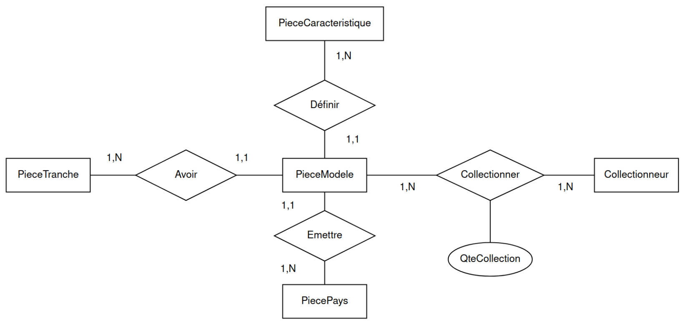

# Projet Web Symfony

Auteurs:
- **Massiles Ghernaout**
- **Antoine Montier**
- **Dorian Lemercier**

Nous avons choisi le sujet n° **1**.

Liens:
- Github: https://github.com/MassiGy/phpsymfony-EuroCoins-DB-Crud
- Gitlab: https://www-apps.univ-lehavre.fr/forge/gm213204/projetwebsymfony 


## Base de données



Cette base de données créée au semestre n°1 est intéressante pour ses différents types de relations.

## Deux versions

Le sujet nous demande de repartir de la base de données du premier semestre. Or, nous avons remarqué une erreur dans cette dernière : Il y a entre `PieceModele` et `PieceCaracteristique` une relation one-to-many. En effet, une caractéristique peut être détenue par plusieurs modèles. Ainsi, l'entité forte est `PieceCaracteristique`, c'est donc `PieceModele` qui doit avoir la clé étrangère de `PieceCaracteristique`. Or, c'est l'inverse qui a été fait. Il y a donc deux versions :

- Version 1 (`dev-dorian`) : Repars de cette base et implémente le CRUD **sans correction**.
- Version 2 (`dev-massiles`) : **Corrige le bug** et implémente le CRUD à partir de cette base corrigée. (voir fichier db/P06_AlimentationMySQL.local.sql)

**Version à prendre en compte:** version sur la branche `dev-massiles`, étant donné que c'est celle-ci qui vient avec le bon jeu de donnée et le bon setup pour les entités et les relations entre celles-ci. Toutefois, la version `dev-dorian` vient avec une interface plus élaborée.


## Installer les dépendances (mise en route du projet)

```sh
    $ composer install 
    $ composer recipes
    $ composer update
    $ symfony server:start
```


## Mise en place du CRUD

**C**reate **R**ead **U**pdate **D**elete, toutes les interactions nécessaires avec la base de données. La difficulté est le nombre de tables, ici il faut pouvoir créer ces types d'objets :

- Pays
- Collectionneur
- Tranche
- Caractéristique
- Modèle de pièce

## Utilisation

L'utilisateur doit avoir la possibilité de mettre à jour et de renseigner les caractéristiques liées à une pièce. Lors de la création de la pièce, si l'utilisateur n'a pas renseigné tous les champs nécessaires, un message d'erreur `Flash` apparaît.

## Sécurité

Nous avons testé notre site CRUD pour les principales attaques :

- Cross-Site Scripting (XSS) : Notre site n'accepte pas les entrées contenant des balises `<script>`, ce qui protège contre les attaques XSS potentielles. Toutes les entrées utilisateur sont correctement échappées ou validées avant d'être affichées sur le site.

- Injection SQL : Notre site n'accepte pas les entrées susceptibles de détourner les requêtes SQL. Toutes les requêtes SQL sont correctement paramétrées ou utilisent des requêtes préparées pour éviter les injections SQL.

Ces mesures de sécurité garantissent que notre site est protégé contre les attaques XSS et les injections SQL, assurant ainsi la sécurité des données et la confidentialité des utilisateurs.

## Problèmes rencontrés

1. La relation many-to-many présente entre PieceModele et Collectionneur est représentée par une table de jonction dans la base de données créée à partir de Doctrine ORM. Il faut noter que la table de jointure n'est pas connectée à une entité à part entière. Ainsi, elle n'a pas d'attribut appelé `QteCollection` comme le schéma Entité/Association l'indique. Cependant, cette valeur peut être calculée facilement grâce à la fonction `count()` de SQL.

2. En ce qui concerne la relation many-to-many entre PieceModele et Collectionneur, l'attribut faisant référence à Collectionneur depuis PieceModele est appelé 'collections' et cela devrait être modifié pour un meilleur nom (comme : 'collectionneurs'). Notez que si une telle action est entreprise, les fichiers CRUD associés devraient être régénérés.

3. En ce qui concerne la relation many-to-many, Doctrine ne configure pas de mappings bidirectionnels dans la base de données pour les deux entités concernées dans la relation. Il établit uniquement un mapping unidirectionnel depuis le côté propriétaire (l'entité contenant la clé inversedBy), mais il ne le fait pas pour l'autre côté (l'entité contenant la clé mappedBy), cela doit être fait manuellement dans les contrôleurs, ou cela peut être ajouté en tant que fonction listener d'événement dans le formulaire pour cette EntityClasseType.

4. Autres points sont détaillés dans le fichier `notes.txt`.
